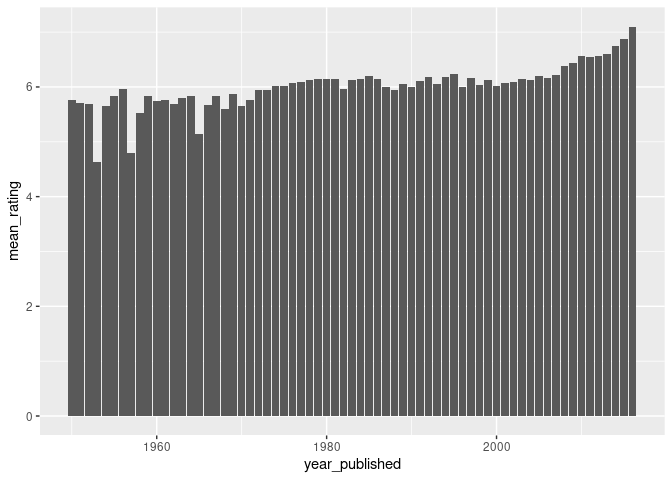

Project Proposal: Board Games
================
GamesOnYourPhone - Grace Acton, Finn Conway, Jackson Donahue

``` r
library(tidyverse)
library(broom)
library(pillar)
library(ggplot2)
```

## 1. Introduction

For our project, we will work with the TidyTuesday Board Games dataset
from March 2019. This set was gathered from BoardGameGeek, a website
with a database of over 90,000 board games with crowd-sourced reviews.
TidyTuesday limited the set to only include games published between 1950
and 2016 with at least 50 ratings. Variables in this set include maximum
and minimum numbers of players, the maximum playtime, whether the game
has expansion packs, the publisher, and, most importantly, the average
rating and number of users who rated it.

We are interested in how different characteristics of board games
influence how they are perceived by players. This can be explored by
looking at how the average rating varies with such variables as the
number of players needed, the playing time, and when the game was
published.

## 2. Data

``` r
board_games <- readr::read_csv("https://raw.githubusercontent.com/rfordatascience/tidytuesday/master/data/2019/2019-03-12/board_games.csv")
```

    ## Rows: 10532 Columns: 22

    ## ── Column specification ────────────────────────────────────────────────────────
    ## Delimiter: ","
    ## chr (12): description, image, name, thumbnail, artist, category, compilation...
    ## dbl (10): game_id, max_players, max_playtime, min_age, min_players, min_play...

    ## 
    ## ℹ Use `spec()` to retrieve the full column specification for this data.
    ## ℹ Specify the column types or set `show_col_types = FALSE` to quiet this message.

``` r
glimpse(board_games)
```

    ## Rows: 10,532
    ## Columns: 22
    ## $ game_id        <dbl> 1, 2, 3, 4, 5, 6, 7, 8, 9, 10, 11, 12, 13, 14, 15, 16, …
    ## $ description    <chr> "Die Macher is a game about seven sequential political …
    ## $ image          <chr> "//cf.geekdo-images.com/images/pic159509.jpg", "//cf.ge…
    ## $ max_players    <dbl> 5, 4, 4, 4, 6, 6, 2, 5, 4, 6, 7, 5, 4, 4, 6, 4, 2, 8, 4…
    ## $ max_playtime   <dbl> 240, 30, 60, 60, 90, 240, 20, 120, 90, 60, 45, 60, 120,…
    ## $ min_age        <dbl> 14, 12, 10, 12, 12, 12, 8, 12, 13, 10, 13, 12, 10, 10, …
    ## $ min_players    <dbl> 3, 3, 2, 2, 3, 2, 2, 2, 2, 2, 2, 2, 3, 3, 2, 3, 2, 2, 2…
    ## $ min_playtime   <dbl> 240, 30, 30, 60, 90, 240, 20, 120, 90, 60, 45, 45, 60, …
    ## $ name           <chr> "Die Macher", "Dragonmaster", "Samurai", "Tal der König…
    ## $ playing_time   <dbl> 240, 30, 60, 60, 90, 240, 20, 120, 90, 60, 45, 60, 120,…
    ## $ thumbnail      <chr> "//cf.geekdo-images.com/images/pic159509_t.jpg", "//cf.…
    ## $ year_published <dbl> 1986, 1981, 1998, 1992, 1964, 1989, 1978, 1993, 1998, 1…
    ## $ artist         <chr> "Marcus Gschwendtner", "Bob Pepper", "Franz Vohwinkel",…
    ## $ category       <chr> "Economic,Negotiation,Political", "Card Game,Fantasy", …
    ## $ compilation    <chr> NA, NA, NA, NA, NA, NA, NA, NA, NA, NA, NA, NA, "CATAN …
    ## $ designer       <chr> "Karl-Heinz Schmiel", "G. W. \"Jerry\" D'Arcey", "Reine…
    ## $ expansion      <chr> NA, NA, NA, NA, NA, NA, NA, NA, NA, "Elfengold,Elfenlan…
    ## $ family         <chr> "Country: Germany,Valley Games Classic Line", "Animals:…
    ## $ mechanic       <chr> "Area Control / Area Influence,Auction/Bidding,Dice Rol…
    ## $ publisher      <chr> "Hans im Glück Verlags-GmbH,Moskito Spiele,Valley Games…
    ## $ average_rating <dbl> 7.66508, 6.60815, 7.44119, 6.60675, 7.35830, 6.52534, 6…
    ## $ users_rated    <dbl> 4498, 478, 12019, 314, 15195, 73, 2751, 186, 1263, 6729…

## 3. Data analysis plan

The main outcome variable we will be looking at is average rating. The
explanatory variables that we will explore are minimum/maximum number of
players, playtime, and year of publication. We may limit our analysis to
observations with a large number of ratings, or do some grouping by
publisher and publishing date.

``` r
board_games %>% 
  group_by(year_published) %>% 
  summarize(mean = mean(average_rating), 
            median = median(average_rating),
            n = n())
```

    ## # A tibble: 67 × 4
    ##    year_published  mean median     n
    ##             <dbl> <dbl>  <dbl> <int>
    ##  1           1950  5.76   5.73     4
    ##  2           1951  5.71   5.71     2
    ##  3           1952  5.68   5.51     3
    ##  4           1953  4.64   4.40     3
    ##  5           1954  5.65   5.67     3
    ##  6           1955  5.83   5.78     4
    ##  7           1956  5.97   5.82     6
    ##  8           1957  4.79   4.79     2
    ##  9           1958  5.52   5.48     8
    ## 10           1959  5.84   5.58     7
    ## # … with 57 more rows

``` r
board_games %>% 
  group_by(year_published) %>% 
  summarize(mean_rating = mean(average_rating)) %>% 
  ggplot(aes(x = year_published, y = mean_rating)) +
  geom_col()
```

<!-- -->

Very preliminary exploratory data analysis, including some summary
statistics and visualizations, along with some explanation on how they
help you learn more about your data. (You can add to these later as you
work on your project.) The statistical method(s) that you believe will
be useful in answering your question(s). (You can update these later as
you work on your project.) What results from these specific statistical
methods are needed to support your hypothesized answer?
