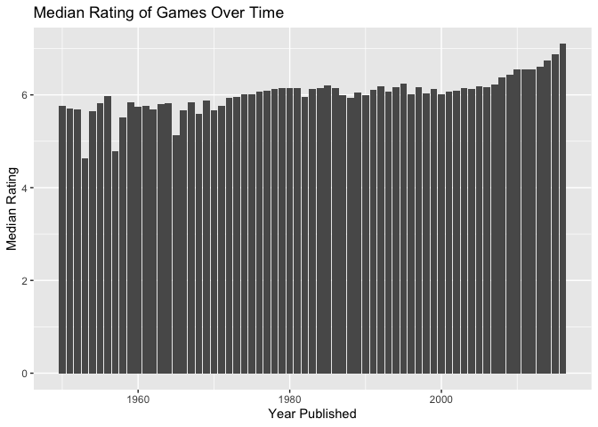

Project Proposal: Board Games
================
GamesOnYourPhone - Grace Acton, Finn Conway, Jackson Donahue

``` r
library(tidyverse)
library(broom)
library(pillar)
library(ggplot2)
library(skimr)
```

## 1. Introduction

For our project, we will work with the TidyTuesday Board Games dataset
from March 2019. This set was gathered from BoardGameGeek, a website
with a database of over 90,000 board games with crowd-sourced reviews.
TidyTuesday limited the set to only include games published between 1950
and 2016 with at least 50 ratings. Variables in this set include maximum
and minimum numbers of players, the maximum playtime, whether the game
has expansion packs, the publisher, and, most importantly, the average
rating and number of users who rated it.

We are interested in how different characteristics of board games
influence how they are perceived by players. This can be explored by
looking at how the average rating varies with such variables as the
number of players needed, the playing time, and when the game was
published. The mechanic and category variables will also be useful to us
in our research, but are vast and will need to be simplified to make
meaningful connections. We may also want to review popularity based on
game artists, locating the most popular ones.

## 2. Data

``` r
board_games <- readr::read_csv("~/Desktop/w2022-project-gamesonyourphone/data/board_games.csv")
```

    ## Rows: 10532 Columns: 22
    ## ── Column specification ────────────────────────────────────────────────────────
    ## Delimiter: ","
    ## chr (12): description, image, name, thumbnail, artist, category, compilation...
    ## dbl (10): game_id, max_players, max_playtime, min_age, min_players, min_play...
    ## 
    ## ℹ Use `spec()` to retrieve the full column specification for this data.
    ## ℹ Specify the column types or set `show_col_types = FALSE` to quiet this message.

``` r
skim(board_games)
```

|                                                  |             |
|:-------------------------------------------------|:------------|
| Name                                             | board_games |
| Number of rows                                   | 10532       |
| Number of columns                                | 22          |
| \_\_\_\_\_\_\_\_\_\_\_\_\_\_\_\_\_\_\_\_\_\_\_   |             |
| Column type frequency:                           |             |
| character                                        | 12          |
| numeric                                          | 10          |
| \_\_\_\_\_\_\_\_\_\_\_\_\_\_\_\_\_\_\_\_\_\_\_\_ |             |
| Group variables                                  | None        |

Data summary

**Variable type: character**

| skim_variable | n_missing | complete_rate | min |   max | empty | n_unique | whitespace |
|:--------------|----------:|--------------:|----:|------:|------:|---------:|-----------:|
| description   |         0 |          1.00 |  49 | 11476 |     0 |    10528 |          0 |
| image         |         1 |          1.00 |  40 |    44 |     0 |    10527 |          0 |
| name          |         0 |          1.00 |   1 |    84 |     0 |    10357 |          0 |
| thumbnail     |         1 |          1.00 |  42 |    46 |     0 |    10527 |          0 |
| artist        |      2773 |          0.74 |   3 |  6860 |     0 |     4641 |          0 |
| category      |        94 |          0.99 |   4 |   173 |     0 |     3860 |          0 |
| compilation   |     10122 |          0.04 |   4 |   734 |     0 |      336 |          0 |
| designer      |       126 |          0.99 |   3 |   184 |     0 |     4678 |          0 |
| expansion     |      7780 |          0.26 |   2 | 11325 |     0 |     2634 |          0 |
| family        |      2808 |          0.73 |   2 |  1779 |     0 |     3918 |          0 |
| mechanic      |       950 |          0.91 |   6 |   314 |     0 |     3209 |          0 |
| publisher     |         3 |          1.00 |   2 |  2396 |     0 |     5512 |          0 |

**Variable type: numeric**

| skim_variable  | n_missing | complete_rate |     mean |       sd |      p0 |     p25 |      p50 |       p75 |   p100 | hist  |
|:---------------|----------:|--------------:|---------:|---------:|--------:|--------:|---------:|----------:|-------:|:------|
| game_id        |         0 |             1 | 62059.20 | 66223.72 |    1.00 | 5444.50 | 28822.50 | 126409.50 | 216725 | ▇▁▁▂▁ |
| max_players    |         0 |             1 |     5.66 |    18.88 |    0.00 |    4.00 |     4.00 |      6.00 |    999 | ▇▁▁▁▁ |
| max_playtime   |         0 |             1 |    91.34 |   659.75 |    0.00 |   30.00 |    45.00 |     90.00 |  60000 | ▇▁▁▁▁ |
| min_age        |         0 |             1 |     9.71 |     3.45 |    0.00 |    8.00 |    10.00 |     12.00 |     42 | ▅▇▁▁▁ |
| min_players    |         0 |             1 |     2.07 |     0.66 |    0.00 |    2.00 |     2.00 |      2.00 |      9 | ▁▇▁▁▁ |
| min_playtime   |         0 |             1 |    80.88 |   637.87 |    0.00 |   25.00 |    45.00 |     90.00 |  60000 | ▇▁▁▁▁ |
| playing_time   |         0 |             1 |    91.34 |   659.75 |    0.00 |   30.00 |    45.00 |     90.00 |  60000 | ▇▁▁▁▁ |
| year_published |         0 |             1 |  2003.07 |    12.28 | 1950.00 | 1998.00 |  2007.00 |   2012.00 |   2016 | ▁▁▁▂▇ |
| average_rating |         0 |             1 |     6.37 |     0.85 |    1.38 |    5.83 |     6.39 |      6.94 |      9 | ▁▁▃▇▁ |
| users_rated    |         0 |             1 |   870.08 |  2880.21 |   50.00 |   85.00 |   176.00 |    518.00 |  67655 | ▇▁▁▁▁ |

## 3. Data analysis plan

The main outcome variable we will be looking at is average rating. The
explanatory variables that we will explore are minimum/maximum number of
players, playtime, and year of publication. We may limit our analysis to
observations with a large number of ratings, or do some grouping by
publisher and publishing date.

``` r
board_games %>% 
  group_by(year_published) %>% 
  summarize(mean = mean(average_rating), 
            median = median(average_rating),
            n = n())
```

    ## # A tibble: 67 × 4
    ##    year_published  mean median     n
    ##             <dbl> <dbl>  <dbl> <int>
    ##  1           1950  5.76   5.73     4
    ##  2           1951  5.71   5.71     2
    ##  3           1952  5.68   5.51     3
    ##  4           1953  4.64   4.40     3
    ##  5           1954  5.65   5.67     3
    ##  6           1955  5.83   5.78     4
    ##  7           1956  5.97   5.82     6
    ##  8           1957  4.79   4.79     2
    ##  9           1958  5.52   5.48     8
    ## 10           1959  5.84   5.58     7
    ## # … with 57 more rows

``` r
board_games %>% 
  group_by(year_published) %>% 
  summarize(mean_rating = mean(average_rating)) %>% 
  ggplot(aes(x = year_published, y = mean_rating)) +
  geom_col() +
    labs(title = "Median Rating of Games Over Time",
       x = "Year Published", 
       y = "Median Rating")
```

<!-- --> 

This visualization demonstrates that rating of games increases the later
the games are created. We may want to investigate this more by creating
other visualizations to determine the cause of this. Is it because games
in a certain category are more popular and those games have only
recently been created? What else can help explain the rising ratings?

### Monopoly

There are 72 versions of Monopoly within this data set. We’d like to
look at this subset to see how they vary in popularity, both in terms of
average rating and the number of ratings written for each.

``` r
board_games %>% 
  filter(grepl("Monopoly", name))
```

    ## # A tibble: 72 × 22
    ##    game_id description        image max_players max_playtime min_age min_players
    ##      <dbl> <chr>              <chr>       <dbl>        <dbl>   <dbl>       <dbl>
    ##  1     684 Rummy for Monopol… //cf…           6           30       8           2
    ##  2    1298 Monopoly Star War… //cf…           8           90       8           2
    ##  3    1420 Don't Go to Jail … //cf…           4           20       8           2
    ##  4    1931 The &quot;Bust~th… //cf…           6          120       8           2
    ##  5    1932 In this game the … //cf…           6          120       8           2
    ##  6    2929 Monopoly with a d… //cf…           8           60       8           2
    ##  7    3020 Forget Star Wars.… //cf…           8          180       8           2
    ##  8    3065 Monopoly - Stock … //cf…           6          120       8           2
    ##  9    3394 It's Monopoly wit… //cf…           6          120       8           2
    ## 10    5029 A monopoly (from … //cf…           8          120       8           2
    ## # … with 62 more rows, and 15 more variables: min_playtime <dbl>, name <chr>,
    ## #   playing_time <dbl>, thumbnail <chr>, year_published <dbl>, artist <chr>,
    ## #   category <chr>, compilation <chr>, designer <chr>, expansion <chr>,
    ## #   family <chr>, mechanic <chr>, publisher <chr>, average_rating <dbl>,
    ## #   users_rated <dbl>

### Catan

There are also a ton of versions of Catan!

``` r
board_games %>% 
  filter(grepl("Catan", name))
```

    ## # A tibble: 24 × 22
    ##    game_id description        image max_players max_playtime min_age min_players
    ##      <dbl> <chr>              <chr>       <dbl>        <dbl>   <dbl>       <dbl>
    ##  1      13 In Catan (formerl… //cf…           4          120      10           3
    ##  2     278 Catan Card Game b… //cf…           2           90      10           2
    ##  3    1897 The foray into sp… //cf…           4          120      12           3
    ##  4    2338 Starship Catan is… //cf…           2           60      12           2
    ##  5    3972 Settlers of Catan… //cf…           4           90      10           3
    ##  6    5824 A simplified buil… //cf…           4           20       4           2
    ##  7   22766 This limited 10th… //cf…           2           60      10           2
    ##  8   24511 From the SimplyFu… //cf…           4           30      10           2
    ##  9   25234 Catan Histories: … //cf…           4          120      10           3
    ## 10   27710 Like all the othe… //cf…           4           15       7           1
    ## # … with 14 more rows, and 15 more variables: min_playtime <dbl>, name <chr>,
    ## #   playing_time <dbl>, thumbnail <chr>, year_published <dbl>, artist <chr>,
    ## #   category <chr>, compilation <chr>, designer <chr>, expansion <chr>,
    ## #   family <chr>, mechanic <chr>, publisher <chr>, average_rating <dbl>,
    ## #   users_rated <dbl>

### Game Categories

We may break our data into smaller subsets based on the categories
assigned to the games. It will be interesting to see the number in each
group, but also how that impacts ratings and popularity.

We are also curious about which categories frequently appear together,
and might explore using a heatmap to see what overlaps are common.

``` r
board_games %>% 
  separate_rows(category, sep = ",") %>% 
  group_by(category) %>% 
  summarize(number = n()) %>% 
  arrange(desc(number))
```

    ## # A tibble: 84 × 2
    ##    category          number
    ##    <chr>              <int>
    ##  1 Card Game           2981
    ##  2 Wargame             2034
    ##  3 Fantasy             1218
    ##  4 Fighting             900
    ##  5 Economic             878
    ##  6 Science Fiction      850
    ##  7 Dice                 838
    ##  8 Party Game           833
    ##  9 Abstract Strategy    710
    ## 10 Children's Game      704
    ## # … with 74 more rows
